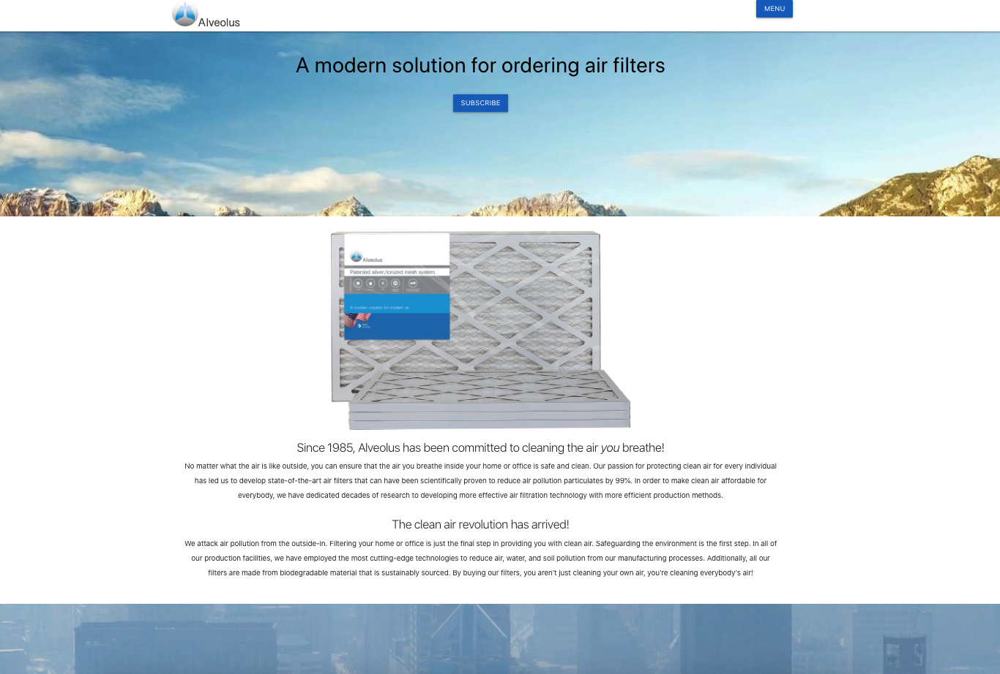

# Project Title 
Alveolus

# Overview
Our goal  is to provide the public with a product that will allow them to stay safe in poor air quality. We are looking to raise awareness of the region's air quality. 
The home page will provide information about our product and our mission. We will also provide contact information in the footer area of every page.

We will have a navigation bar that will provide links to the map. The map page will have a form for the user to enter in their location or any location of interest. Once entered the air quality and weather information will display in a table above the map. Below the table is a global map that will allow the user to browse locations of interest.

# Preview

# Link to Deployed Site
  * [Group-Project](https://kell-b.github.io/Group-Project/)
  
# Resources Used
  * HTML
  * CSS
  * Materialize
  * JQuery
  * Local Storage
  
# Versioning 
  * GitHub

# Team Members 
  * Austin, Miguel, McKell, Mark

# Tasks 
 ## Austin 
   * Front-end  
 ## McKell 
   * Front-end 
   * Manage GitHub Repo 
 ## Miguel: 
   * Back-end  
 ## Mark:
   * Back-end
   * Register for API keys Detailed list on GitHub